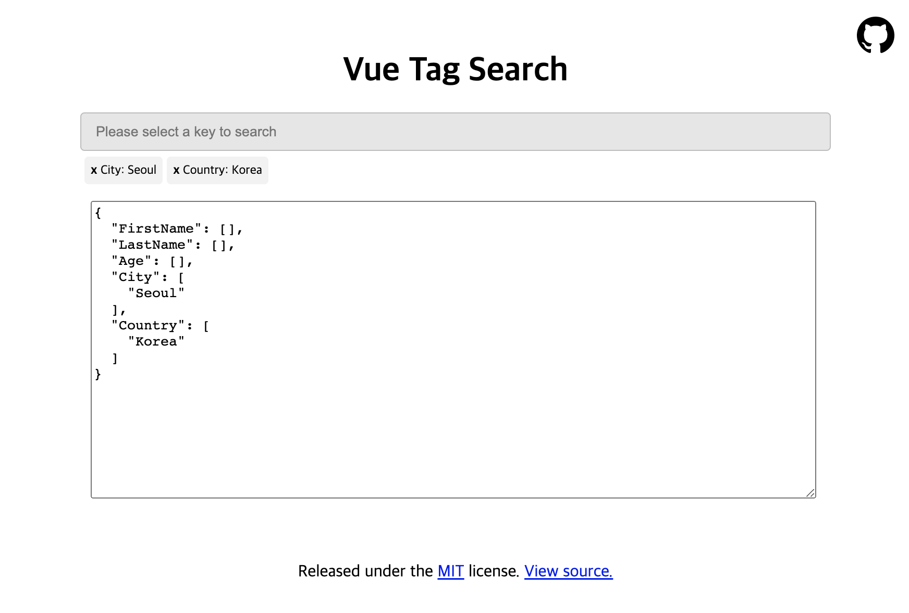

# Vue Tag Search

Vuejs 2.0 - Tag-style key-based input for search UI

## Live Demo

TBD
<!-- [link]() -->

## Example Code

```bash
# Clone the project
git clone https://github.com/Seungwoo321/vue-tag-search.git

# Go into the cloned directory
cd vue-tag-search

# npm install
npm install

# npm run serve
npm run serve
```

Open browser to <http://localhost:8080>



## Installation

```shall
npm i vue-tag-search
```

## Usage

```html
<template>
  <vue-tag-search
    v-model="searchModel"
    :data="searchKeys"
    placeholder="Please select a key to search"
    @add:searchModel="addSearchModel"
    @remove:searchModel="removeSearchModel"
  >
  </vue-tag-search>
</template>

<script>
import VueTagSearch from 'vue-tag-search'

export default {
  components: {
    VueTagSearch
  },
  data () {
    return {
      searchKeys: [
        'FirstName', 'LastName', 'Age', 'City', 'Country'
      ],
      searchModel: {
        FirstName: [],
        LastName: [],
        Age: [],
        City: ['Seoul'],
        Country: ['Korea']
      }
    }
  },
  methods: {
    addSearchModel ([key, value]) {
      this.searchModel[key].push(value)
    },
    removeSearchModel ([key, value]) {
      this.searchModel[key].splice(this.searchModel[key].indexOf(value), 1)
    }
  }
}
</script>

```

## Inspired

* [museui/muse-ui](https://github.com/museui/muse-ui) - Material Design UI library for Vuejs 2.0

## License

MIT
